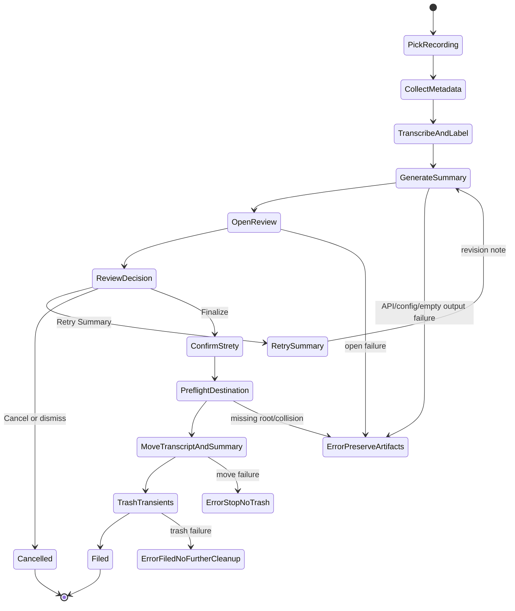

# feat: Add API Meeting Summary Workflow

## Overview

Add an API-backed summary branch to the existing Scribe meeting workflow. The picker will start from a recording, collect title/date/type, run the existing speaker-label transcript flow, generate one Markdown summary from the transcript using OpenAI, open the summary for review, and then let the user finalize, retry, or cancel. Finalization files the transcript and summary into the selected Armen OS meeting subfolder and moves only defined transient artifacts to Trash after filing succeeds.

## Problem Frame

The current workflow stops at a named-speaker transcript and leaves summary generation, meeting-folder filing, and cleanup as manual work. The goal is to remove the ChatGPT web UI from the critical path while preserving the current review-and-Strety handoff. The origin requirements define a fixed local meetings root, one shared v1 summary shape, canonical examples, and a strict post-review confirmation gate before any move or Trash operation.

## Requirements Trace

- R1-R5. Start from an already-supported recording file, collect title/date/type explicitly, route by selected meeting type, and fail clearly if the required meetings root or subfolder is unavailable.
- R6-R13. Generate a labeled transcript first, then one OpenAI-backed Markdown summary using a shared v1 summary contract and canonical examples.
- R14-R22. Preserve the speaker-identification flow, open the summary for review, support `Finalize`, `Retry Summary`, and `Cancel`, and require confirmation that Strety handoff is complete or intentionally skipped.
- R23-R29. Move transcript and summary before Trash operations, stop on partial failure, preserve artifacts on cancel or API failure, and follow the defined artifact lifecycle.
- Success criteria. The generated summary must be usable in the current Armen OS review-and-Strety workflow without material rewriting, and finalization must leave only transcript and summary as durable meeting-folder artifacts.

## Scope Boundaries

- No direct writes to Strety in this version.
- No multiple summary variants, separate archive/Strety outputs, or retry-history files.
- No automatic meeting-type inference.
- No fallback filing locations when the fixed meetings root is unavailable.
- No meeting-type-specific summary templates in v1; folder routing varies by type, summary contract does not.
- No non-OpenAI provider fallback or provider abstraction in v1.

## Context & Research

### Relevant Code and Patterns

- `scribe.py` is a single-module CLI pipeline: normalize audio, transcribe, diarize, merge, label speakers, format output, and write the transcript.
- `scribe_picker.zsh` owns macOS interaction: file picker, title/date prompts, logging, `open`, notifications, and closing the Apple Terminal tab on success.
- `tests/test_scribe.py` uses `pytest`, `monkeypatch`, `MagicMock`, and fake context managers to isolate filesystem, subprocess, and pipeline behavior.
- Error handling should follow `ScribeError` for recoverable pipeline failures and CLI-level `SystemExit` messages for user-facing failures.
- Existing temp audio files are cleaned with context managers and `finally`; summary retry should follow the same "write temp, validate, replace" pattern.

### Institutional Learnings

- No `docs/solutions/` directory exists in this repo.
- `docs/context/2026-06-06-meeting-workflow-session.md` confirms the existing order: transcription, diarization, speaker labeling, then later summarization. It also records the prior warning not to invent summary format; the origin requirements now resolve that by using filed Armen OS examples as the reference set.

### External References

- OpenAI Responses API text generation guide: `https://platform.openai.com/docs/guides/text-generation`
- OpenAI Python SDK: `https://github.com/openai/openai-python`
- OpenAI structured outputs guide: `https://platform.openai.com/docs/guides/structured-outputs`

## Key Technical Decisions

- **Use the OpenAI Python SDK and Responses API:** This is the direct OpenAI-backed path for text generation and avoids browser automation against ChatGPT.
- **Configure through environment variables:** Require `OPENAI_API_KEY`; use `SCRIBE_OPENAI_MODEL` for the model. Avoid committing credentials or adding a local config format in v1.
- **Keep deterministic lifecycle logic in Python:** Add testable Python functions for summary generation, validation, destination preflight, atomic retry replacement, final move, and Trash sequencing.
- **Keep macOS UI in the picker:** `scribe_picker.zsh` should keep file selection, metadata/type prompts, opening the summary, confirmation dialogs, notifications, and Terminal behavior.
- **Read canonical examples at runtime from the fixed meetings root:** This preserves the user's live examples as the current style reference. Missing examples should fail summary generation clearly. The canonical files are `Sales-and-CS-L10_2026-06-08_Summary.md`, `Numa-Armen Stone Monthly Review - 6.5.26.txt`, and `1x1-with-Caroline-Massey_2026-06-17_Summary_and_Transcript.md`.
- **Fail on destination collisions:** If the selected meeting folder already contains the target transcript or summary filename, stop before moving anything.
- **Generate summary to a temp file before replacing:** Retry must not destroy the current summary unless the new API response validates.
- **Stage final filing before cleanup:** Copy transcript and summary to destination temp names, validate both staged files, atomically rename them to final destination names, and only then clean up source-side artifacts.
- **Use Trash for cleanup:** Recording, source-side transcript/summary after successful filing, log, and any materialized scratch files move to Trash only after transcript and summary are filed successfully.

## Open Questions

### Resolved During Planning

- **Summary filename:** Use the transcript basename with `_Transcript` replaced by `_Summary`, producing names such as `Sales-and-CS-L10_2026-06-08_Summary.md`.
- **Destination collision behavior:** Stop with an explicit error before moving or trashing anything.
- **Editor open success:** Treat a zero exit from `open` as launch success and rely on the explicit review dialog for user confirmation.
- **Retry after manual edits:** Warn in the retry dialog that retry replaces the current summary content; generate to temp and replace only after successful validation.
- **Scratch files on cancel:** Avoid materialized scratch files where possible. If any are created in the source directory, preserve them on cancel and Trash them on successful finalize.

### Deferred to Implementation

- **Exact OpenAI model default:** Implementation should support `SCRIBE_OPENAI_MODEL`; whether to require it or provide a documented default can be finalized while wiring the SDK.
- **Exact transcript size limit:** Implementation should choose a default model, define a supported input-size budget for transcript plus examples, and fail before the API call when the input is too large. Chunking or summarize-then-synthesize is out of scope for v1 unless implementation finds it is needed for ordinary meeting lengths.
- **Exact AppleScript dialog text:** The text can be refined during implementation as long as the three actions and Strety confirmation are preserved.
- **Exact summary prompt wording:** The plan fixes inputs, examples, and acceptance behavior; implementation can tune wording against the canonical files.

## High-Level Technical Design

> *This illustrates the intended approach and is directional guidance for review, not implementation specification. The implementing agent should treat it as context, not code to reproduce.*

## Implementation Units

- [x] **Unit 1: Summary Contract And OpenAI Client**

**Goal:** Add a testable summary-generation layer that builds the prompt from transcript text, meeting metadata, canonical examples, and an optional retry note, then validates a Markdown summary response.

**Requirements:** R7-R13, R28

**Dependencies:** Existing transcript output behavior.

**Files:**
- Modify: `scribe.py`
- Modify: `pyproject.toml`
- Modify: `uv.lock`
- Test: `tests/test_scribe.py`

**Approach:**
- Add the OpenAI Python SDK dependency.
- Introduce the minimum data shape needed for title, date, meeting type, transcript path, summary path, canonical examples, and optional revision note. Use a small value object only if it reduces argument sprawl; avoid a separate config abstraction.
- Read `OPENAI_API_KEY` from the environment and model from `SCRIBE_OPENAI_MODEL`.
- Load the three canonical example files through the fixed meetings root and fail with `ScribeError` if any required reference file is missing.
- Preflight the size of transcript text plus canonical examples before the API call. If the input exceeds the supported v1 budget for the selected/default model, fail with `ScribeError` and do not call the API.
- Generate one Markdown summary through the Responses API using transcript text and examples.
- Validate summary output as non-empty Markdown with a recognizable heading/body and no surrounding code-fence wrapper.
- Raise `ScribeError` for missing credentials, empty transcript, missing examples, API failures, empty responses, or malformed responses.

**Execution note:** Implement validation and failure-path tests before connecting the real SDK call.

**Patterns to follow:**
- `run_transcription` for external command error wrapping and invalid-output handling.
- `format_text` and `default_output_path` for pure helpers with isolated tests.

**Test scenarios:**
- Happy path: transcript text plus metadata and examples produces validated Markdown summary content.
- Edge case: blank or whitespace-only transcript raises `ScribeError` before calling the API.
- Error path: missing `OPENAI_API_KEY` raises a user-facing `ScribeError`.
- Error path: missing canonical example file raises `ScribeError` with the missing reference path.
- Error path: oversized transcript plus examples raises `ScribeError` before calling the API.
- Error path: API exception is wrapped in `ScribeError` without exposing credentials.
- Error path: empty or code-fenced-only response is rejected.
- Integration: retry note is included in the generation request while preserving the same transcript and canonical examples.

**Verification:**
- Unit tests prove prompt inputs, environment validation, size preflight, response validation, and error wrapping without making live API calls. The dependency lockfile is updated after adding the OpenAI SDK.

- [x] **Unit 2: Summary CLI Surface And File Naming**

**Goal:** Expose summary generation from the Python CLI so the picker can call a deterministic command after transcript generation.

**Requirements:** R6-R13, R19-R20, success criteria for reviewable summary.

**Dependencies:** Unit 1.

**Files:**
- Modify: `scribe.py`
- Test: `tests/test_scribe.py`
- Modify: `README.md`

**Approach:**
- Add CLI options that let the picker request summary generation from an existing transcript and metadata, without rerunning transcription.
- Use the transcript filename to derive the summary path by replacing `_Transcript.md` with `_Summary.md`.
- Support optional revision note input for retry.
- Generate the summary to a temporary file in the transcript directory, validate it, then atomically replace the target summary file.
- Keep the original transcription CLI behavior unchanged when summary options are not used.

**Patterns to follow:**
- Existing `main` tests that monkeypatch pipeline functions and assert output paths.
- Existing titled default output convention for `Title_YYYY-MM-DD_Transcript.md`.

**Test scenarios:**
- Happy path: summary mode reads an existing transcript and writes `Title_YYYY-MM-DD_Summary.md`.
- Happy path: retry mode overwrites the existing summary only after new validated content exists.
- Edge case: transcript filename without `_Transcript.md` gets a clear summary-path error or documented fallback.
- Error path: invalid API response leaves the existing summary unchanged.
- Error path: missing transcript file exits with a clear error.
- Regression: normal `scribe recording.m4a --title ...` still writes only the transcript when summary mode is not requested.

**Verification:**
- Tests cover filename derivation, non-summary CLI regression, retry replacement, and preservation on failure.

- [x] **Unit 3: Finalization And Artifact Lifecycle Helpers**

**Goal:** Add testable Python helpers for destination validation, staged filing, collision detection, and Trash-based cleanup.

**Requirements:** R3-R5, R23-R29

**Dependencies:** Unit 2.

**Files:**
- Modify: `scribe.py`
- Test: `tests/test_scribe.py`

**Approach:**
- Define the fixed meeting subfolders as `L10`, `Customer`, and `Other`, with destination validation against the required meetings root.
- Add a finalization helper that receives source recording, transcript, summary, log path, meeting type, and optional scratch paths.
- Preflight the root, selected subfolder, destination filenames, and collisions before moving anything.
- Copy transcript and summary to destination temp names, validate that both staged copies exist, then atomically rename staged files into the final destination names.
- After the destination transcript and summary both exist under their final names, send the source recording, source-side transcript and summary files, log, and scratch artifacts to Trash.
- Prefer macOS Trash via an OS-level mechanism rather than permanent unlinking. Keep this behind a helper that can be mocked in tests.
- Stop on any copy, rename, or Trash failure and surface exact source/destination paths. If a second atomic rename fails after the first succeeds, attempt to roll back the first rename to its temp name and report whether rollback succeeded.

**Execution note:** Treat this unit as safety-critical file lifecycle work; add characterization-style tests for every destructive-adjacent path before wiring it into the picker.

**Patterns to follow:**
- `ScribeError` for user-visible failure states.
- Current tests' `tmp_path` filesystem assertions.

**Test scenarios:**
- Happy path: transcript and summary are staged, atomically renamed into selected folder, then recording, source-side transcript/summary, and log are passed to Trash helper.
- Error path: missing meetings root stops before moving anything.
- Error path: invalid meeting type stops before moving anything.
- Error path: destination transcript collision stops before moving anything.
- Error path: destination summary collision stops before moving anything.
- Error path: transcript staging succeeds but summary staging fails; no final destination names are created and no Trash helper is called.
- Error path: first atomic rename succeeds but second atomic rename fails; rollback is attempted and no Trash helper is called.
- Error path: Trash helper fails after successful filing; transcript and summary remain filed and later cleanup stops.
- Cancel behavior: finalization helper is not called, so all artifacts remain untouched.

**Verification:**
- Filesystem tests prove no Trash call happens before successful staged filing, no destination overwrite occurs, and split-state filing is either avoided or reported with rollback status.

- [x] **Unit 4: Picker Review, Retry, And Finalize Flow**

**Goal:** Update the macOS launcher to orchestrate metadata collection, transcript generation, summary generation, review, retry, finalization, notifications, and Terminal behavior.

**Requirements:** R1-R5, R14-R22, R23-R29

**Dependencies:** Units 1-3.

**Files:**
- Modify: `scribe_picker.zsh`
- Verify: `zsh -n scribe_picker.zsh`

**Approach:**
- Add a meeting-type prompt with explicit choices for `L10`, `Customer`, and `Other`.
- Before expensive transcription work, verify that the picker process can see `OPENAI_API_KEY` and the selected/default model setting or can report the missing setup clearly through AppleScript.
- Keep the existing title/date prompts and `--label-speakers` transcript generation.
- After transcript generation, call the summary CLI mode with title/date/type metadata.
- Open the summary with the normal Markdown editor workflow. Treat `open` failure as a hard stop with artifacts preserved.
- Present a review dialog with `Finalize`, `Retry Summary`, and `Cancel`.
- On retry, prompt for a revision note, warn that the current summary will be replaced, call summary generation again, reopen the summary, and return to the review dialog.
- On finalize, ask for confirmation that Strety handoff is complete or intentionally skipped, then call the Python finalization helper/CLI surface.
- Preserve current behavior that successful runs can close their own Apple Terminal tab, while failures and cancellations remain visible.

**Patterns to follow:**
- Existing AppleScript prompt style and cancellation sentinel handling in `scribe_picker.zsh`.
- Existing log piping through `tee`.

**Test scenarios:**
- Test expectation: shell UI is hard to unit test directly; keep deterministic lifecycle behavior in Python and verify picker syntax with `zsh -n scribe_picker.zsh`.
- Integration scenario: manual dry run with a short fixture recording should show metadata prompts, speaker labeling, summary opening, review dialog, retry path, cancel preservation, and finalize filing.
- Error path: missing API environment shows a clear AppleScript error before transcription begins.
- Error path: missing summary command or failed `open` leaves Terminal visible and artifacts untouched.

**Verification:**
- Shell syntax passes.
- Manual workflow landmarks match the requirements: metadata prompt, speaker labeling, summary opens, review choices, Strety confirmation, final filing, and Trash cleanup.

- [x] **Unit 5: Documentation And Operational Setup**

**Goal:** Document the new summary workflow, environment configuration, canonical examples, failure behavior, and manual verification path.

**Requirements:** All user-facing success criteria and setup assumptions.

**Dependencies:** Units 1-4.

**Files:**
- Modify: `README.md`
- Test: none

**Approach:**
- Add a README section for API-backed summaries, required environment variables, canonical example behavior, and the fixed meetings destination.
- Explain that v1 does not write to Strety, does not infer meeting type, and uses Trash rather than permanent deletion.
- Mention that the old "recover prompt" blocker is superseded by the canonical filed examples named in this plan.
- Include a short operator checklist for a first real run and expected failure messages for missing API key, missing destination folder, and destination collision.

**Patterns to follow:**
- Existing concise README usage sections.
- Existing `docs/context` handoff style.

**Test scenarios:**
- Test expectation: none -- documentation-only unit.

**Verification:**
- A reader can set environment variables, run the picker, understand the review gate, and recover safely from cancellation or failure.

## System-Wide Impact

- **Interaction graph:** `scribe_picker.zsh` remains the user-facing orchestrator; `scribe.py` gains summary and finalization helpers plus CLI surfaces for testable behavior.
- **Error propagation:** API, validation, file, and Trash errors should become `ScribeError` or clear CLI exits. Picker failures should leave the Terminal visible.
- **State lifecycle risks:** Retry must replace summary atomically; finalize must preflight collisions; Trash must happen only after transcript and summary are filed.
- **API surface parity:** Existing transcript CLI flags and output behavior must remain backward compatible.
- **Integration coverage:** Python unit tests cover deterministic lifecycle logic; shell syntax plus a manual dry run covers macOS UI behavior.
- **Unchanged invariants:** Existing transcript-only, diarized transcript, JSON output, title/date transcript naming, and speaker labeling behavior remain intact unless the new summary workflow is explicitly invoked.

## Risks & Dependencies

| Risk | Mitigation |
|------|------------|
| API output does not match trusted meeting-summary quality | Use bounded canonical examples, a shared v1 contract, validation, and review/retry before filing. |
| Model availability or behavior changes | Make model configurable through `SCRIBE_OPENAI_MODEL`; document the expected setting. |
| Long transcripts exceed the selected model context budget | Preflight transcript plus example size before the API call and fail clearly in v1; chunked summarization remains out of scope unless needed for ordinary meeting lengths. |
| Credentials missing or misconfigured | Fail before summary generation with a clear error and no file moves. |
| Destination collisions overwrite prior meeting artifacts | Preflight both transcript and summary destinations and fail on existing files. |
| Partial finalization splits files between source and destination | Stage copies under temp names, atomically rename both into place, attempt rollback on second rename failure, and stop before any Trash operation. |
| Manual Strety handoff is skipped accidentally | Require explicit Strety-complete or intentionally-skipped confirmation before finalize. |
| Shell UI becomes hard to test | Keep file lifecycle and API behavior in Python; limit shell to prompts and command orchestration. |

## Documentation / Operational Notes

- Document `OPENAI_API_KEY` and `SCRIBE_OPENAI_MODEL`.
- Document the supported setup path for exposing `OPENAI_API_KEY` to the picker process.
- Document the fixed meetings root as a local machine requirement, while keeping repo plan references portable.
- Document that canonical examples are read from the existing meetings folder and missing examples are a setup error.
- Add manual verification notes for the first real recording run, including what should remain after cancel and after finalize.

## Sources & References

- **Origin document:** [docs/brainstorms/2026-06-27-meeting-summary-api-workflow-requirements.md](../brainstorms/2026-06-27-meeting-summary-api-workflow-requirements.md)
- Existing handoff: [docs/context/2026-06-06-meeting-workflow-session.md](../context/2026-06-06-meeting-workflow-session.md)
- Core CLI: [scribe.py](../../scribe.py)
- Picker launcher: [scribe_picker.zsh](../../scribe_picker.zsh)
- Tests: [tests/test_scribe.py](../../tests/test_scribe.py)
- OpenAI Responses API text generation guide: [platform.openai.com/docs/guides/text-generation](https://platform.openai.com/docs/guides/text-generation)
- OpenAI Python SDK: [github.com/openai/openai-python](https://github.com/openai/openai-python)
- OpenAI structured outputs guide: [platform.openai.com/docs/guides/structured-outputs](https://platform.openai.com/docs/guides/structured-outputs)
